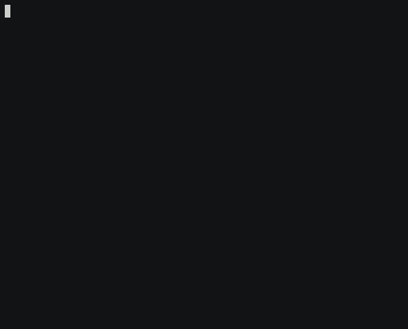
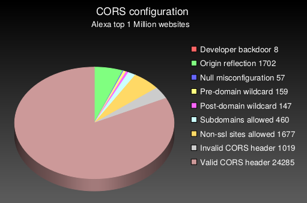

## CORStest
### A simple CORS misconfiguration scanner

**Based on the research of [James Kettle](https://twitter.com/albinowax)**

CORStest is a *quick & dirty* Python 2 tool to find Cross-Origin Resource Sharing ([CORS](https://www.w3.org/TR/cors/)) misconfigurations. It takes a text file as input which may contain a list of domain names or URLs. Currently, the following potential vulnerabilities are detected by sending a certain `Origin` request header and checking for the `Access-Control-Allow-Origin` response header:

- **Developer backdoor:** Insecure dev origins like JSFiddle or CodePen are allowed to access this resource
- **Origin reflection:** The origin is simply echoed in ACAO header, any site is allowed to access this resource
- **Null misconfiguration:** Any site is allowed to access by forcing the `null` origin via a sandboxed iframe
- **Pre-domain wildcard:** *not*domain.com is allowed access, which can simply be registered by an attacker
- **Post-domain wildcard:** domain.com.*evil.com* is allowed access, which can be registered by an attacker
- **Subdomains allowed:** *sub*.domain.com allowed access, exploitable if attacker finds XSS in any subdomain
- **Non-ssl sites allowed:** A http origin is allowed access to a https resource, allows MitM to break encryption
- **Invalid CORS header:** Wrong use of wildcard or multiple origins, not a security problem but should be fixed

Note that these vulnerabilities/misconfigurations are dependend on the context. In most scenarios, they can only be exploited by an attacker if the `Access-Control-Allow-Credentials header` is present (see `-q` flag).

### Usage

```
usage: corstest.py [arguments] infile

positional arguments:
  infile         File with domain or URL list

optional arguments:
  -h, --help     show this help message and exit
  -c name=value  Send cookie with all requests
  -p processes   multiprocessing (default: 32)
  -s             always force ssl/tls requests
  -q             quiet, allow-credentials only
  -v             produce a more verbose output
```

### Example

Use of CORStest to detect misconfigurations for the Alexa top 750 sites (with `Access-Control-Allow-Credentials`):



### Evaluation

Running this CORStest on the  Alexa [top 1 million](http://s3.amazonaws.com/alexa-static/top-1m.csv.zip) sites reveals the following results:



Note that the absolute numbers are quite low, because only 3% of the 1,000,000 tested websites had CORS enabled on their main page and could be analyzed for misconfigurations. This test took about 14 hours on a decent line (DSL). If you have a fast Internet connection, try to increase the number of parallel processes to `-p50` or more.

### Background

Read more on the technical backgorund of CORS misconfigurations in this fine [blogpost](http://blog.portswigger.net/2016/10/exploiting-cors-misconfigurations-for.html) or check out this [talk](https://www.youtube.com/watch?v=wgkj4ZgxI4c). A large scale evaluation of CORS misconfigurations using *CORStest* is documented [here](http://web-in-security.blogspot.de/2017/07/cors-misconfigurations-on-large-scale.html).
